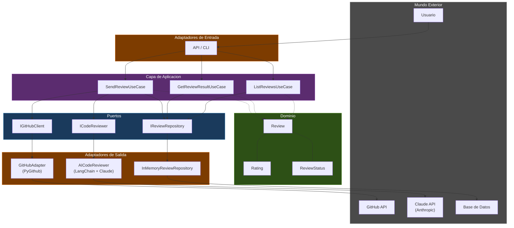
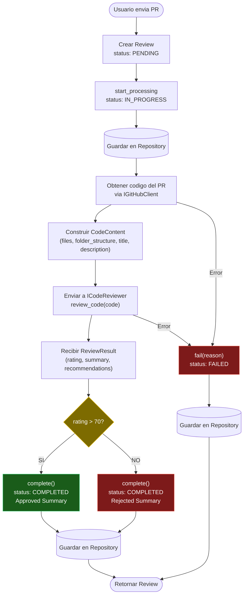
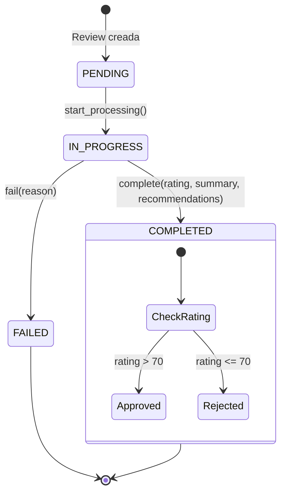
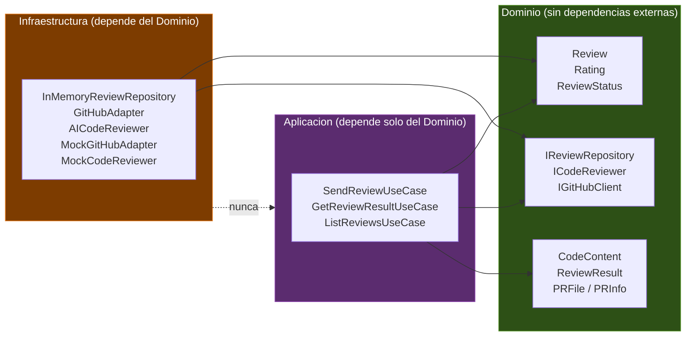

# Dominio - Code Review System

Representacion visual del dominio de la aplicacion usando diagramas Mermaid.

## Diagrama de Clases

```mermaid
classDiagram
    direction TB

    %% ──────────────────────────────────────
    %% VALUE OBJECTS
    %% ──────────────────────────────────────

    class ReviewStatus {
        <<enumeration>>
        PENDING
        IN_PROGRESS
        COMPLETED
        FAILED
    }

    class Rating {
        <<value object>>
        -int _value
        +int value
        +is_passing() bool
        +__eq__(other) bool
        +__hash__() int
    }

    %% ──────────────────────────────────────
    %% ENTIDAD PRINCIPAL
    %% ──────────────────────────────────────

    class Review {
        <<entity>>
        +str id
        +str pr_id
        +ReviewStatus status
        +Rating rating
        +str summary
        +list~str~ recommendations
        +datetime created_at
        +datetime completed_at
        +is_approved() bool
        +complete(rating, summary, recommendations) void
        +fail(reason) void
        +start_processing() void
    }

    %% ──────────────────────────────────────
    %% DATA TRANSFER OBJECTS
    %% ──────────────────────────────────────

    class CodeContent {
        <<dataclass>>
        +dict~str, str~ files
        +list~str~ folder_structure
        +str pr_title
        +str pr_description
    }

    class ReviewResult {
        <<dataclass>>
        +int rating
        +str summary
        +list~str~ recommendations
    }

    class PRFile {
        <<dataclass>>
        +str filename
        +str content
        +str status
        +str patch
    }

    class PRInfo {
        <<dataclass>>
        +str pr_id
        +str title
        +str description
        +str author
        +list~PRFile~ files
        +list~str~ folder_structure
    }

    %% ──────────────────────────────────────
    %% PUERTOS (INTERFACES)
    %% ──────────────────────────────────────

    class IReviewRepository {
        <<interface>>
        +save(review: Review) Review
        +find_by_pr_id(pr_id: str) Review | None
        +find_by_id(review_id: str) Review | None
        +find_all() list~Review~
        +delete(review_id: str) bool
    }

    class ICodeReviewer {
        <<interface>>
        +review_code(code: CodeContent) ReviewResult
        +get_review_rules() list~str~
    }

    class IGitHubClient {
        <<interface>>
        +get_pr_code(pr_id: str) PRInfo
        +get_pr_files(pr_id: str) list~PRFile~
        +post_review_comment(pr_id: str, comment: str) bool
    }

    %% ──────────────────────────────────────
    %% CASOS DE USO
    %% ──────────────────────────────────────

    class SendReviewUseCase {
        <<use case>>
        -IReviewRepository _review_repository
        -ICodeReviewer _code_reviewer
        -IGitHubClient _github_client
        +execute(pr_id: str) Review
    }

    class GetReviewResultUseCase {
        <<use case>>
        -IReviewRepository _review_repository
        +execute(pr_id: str) Review
    }

    class ListReviewsUseCase {
        <<use case>>
        -IReviewRepository _review_repository
        +execute() list~Review~
    }

    class ReviewNotFoundError {
        <<exception>>
    }

    %% ──────────────────────────────────────
    %% ADAPTADORES (INFRAESTRUCTURA)
    %% ──────────────────────────────────────

    class InMemoryReviewRepository {
        <<adapter>>
        -dict~str, Review~ _reviews
        +save(review: Review) Review
        +find_by_pr_id(pr_id: str) Review | None
        +find_by_id(review_id: str) Review | None
        +find_all() list~Review~
        +delete(review_id: str) bool
        +clear() void
    }

    class GitHubAdapter {
        <<adapter>>
        -str _token
        -str _repo_name
        +get_pr_code(pr_id: str) PRInfo
        +get_pr_files(pr_id: str) list~PRFile~
        +post_review_comment(pr_id: str, comment: str) bool
    }

    class MockGitHubAdapter {
        <<adapter mock>>
        -dict~str, PRInfo~ _mock_prs
        +get_pr_code(pr_id: str) PRInfo
        +get_pr_files(pr_id: str) list~PRFile~
        +post_review_comment(pr_id: str, comment: str) bool
    }

    class AICodeReviewer {
        <<adapter>>
        -str _api_key
        -str _model
        -list~str~ _rules
        +review_code(code: CodeContent) ReviewResult
        +get_review_rules() list~str~
    }

    class MockCodeReviewer {
        <<adapter mock>>
        -int _default_rating
        -list~str~ _rules
        +review_code(code: CodeContent) ReviewResult
        +get_review_rules() list~str~
    }

    %% ──────────────────────────────────────
    %% RELACIONES - Dominio
    %% ──────────────────────────────────────

    Review *-- ReviewStatus : status
    Review *-- Rating : rating
    IReviewRepository ..> Review : gestiona
    ICodeReviewer ..> CodeContent : recibe
    ICodeReviewer ..> ReviewResult : retorna
    IGitHubClient ..> PRInfo : retorna
    IGitHubClient ..> PRFile : retorna
    PRInfo o-- PRFile : contiene

    %% ──────────────────────────────────────
    %% RELACIONES - Casos de Uso -> Puertos
    %% ──────────────────────────────────────

    SendReviewUseCase --> IReviewRepository : usa
    SendReviewUseCase --> ICodeReviewer : usa
    SendReviewUseCase --> IGitHubClient : usa
    GetReviewResultUseCase --> IReviewRepository : usa
    GetReviewResultUseCase ..> ReviewNotFoundError : lanza
    ListReviewsUseCase --> IReviewRepository : usa

    %% ──────────────────────────────────────
    %% RELACIONES - Adaptadores implementan Puertos
    %% ──────────────────────────────────────

    InMemoryReviewRepository ..|> IReviewRepository : implementa
    GitHubAdapter ..|> IGitHubClient : implementa
    MockGitHubAdapter ..|> IGitHubClient : implementa
    AICodeReviewer ..|> ICodeReviewer : implementa
    MockCodeReviewer ..|> ICodeReviewer : implementa
```

## Diagrama de Arquitectura Hexagonal

## Diagrama de Flujo - sendReview(pr_id)

## Diagrama de Estados - Review

## Mapa de Dependencias por Capa

