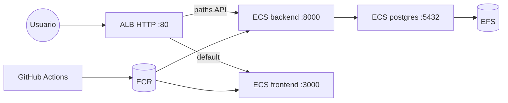

# Infraestructura AWS (Terraform + GitHub Actions)

Despliegue minimo del entorno **dev** en AWS:

- **ECR**: imagenes `backend` y `frontend`
- **ECS Fargate**: 3 servicios (backend FastAPI, frontend Next.js, Postgres+pgvector)
- **ALB HTTP**: routing por path (`/reviews*`, `/docs`, etc. → backend; resto → frontend)
- **EFS**: persistencia de datos de Postgres
- **Cloud Map**: DNS interno `db.cursoai-dev.local` para el backend

Terraform provisiona la infra. GitHub Actions hace build/push y rolling deploy (no ejecuta `terraform apply`).

## Arquitectura



## Prerrequisitos

- [Terraform](https://www.terraform.io/downloads) >= 1.6
- [AWS CLI](https://aws.amazon.com/cli/) configurado (`aws configure`)
- Cuenta AWS con permisos para VPC, ECS, ECR, ALB, EFS, IAM, Secrets Manager
- Repositorio en GitHub con OIDC configurado hacia AWS

## 1. Bootstrap (una sola vez por cuenta)

### State backend (S3 + DynamoDB)

```bash
aws s3api create-bucket \
  --bucket cursoai-tfstate \
  --region us-east-1

aws s3api put-bucket-versioning \
  --bucket cursoai-tfstate \
  --versioning-configuration Status=Enabled

aws dynamodb create-table \
  --table-name cursoai-tfstate-lock \
  --attribute-definitions AttributeName=LockID,AttributeType=S \
  --key-schema AttributeName=LockID,KeyType=HASH \
  --billing-mode PAY_PER_REQUEST \
  --region us-east-1
```

### Rol IAM para GitHub Actions (OIDC)

1. En IAM → Identity providers, agregar **OpenID Connect** con URL `https://token.actions.githubusercontent.com` y audience `sts.amazonaws.com`.
2. Crear rol `github-actions-cursoai-deploy` con trust policy (reemplazar `OWNER/REPO`):

```json
{
  "Version": "2012-10-17",
  "Statement": [{
    "Effect": "Allow",
    "Principal": {
      "Federated": "arn:aws:iam::ACCOUNT_ID:oidc-provider/token.actions.githubusercontent.com"
    },
    "Action": "sts:AssumeRoleWithWebIdentity",
    "Condition": {
      "StringEquals": {
        "token.actions.githubusercontent.com:aud": "sts.amazonaws.com"
      },
      "StringLike": {
        "token.actions.githubusercontent.com:sub": "repo:OWNER/REPO:*"
      }
    }
  }]
}
```

3. Adjuntar politica con permisos minimos de deploy:

```json
{
  "Version": "2012-10-17",
  "Statement": [
    {
      "Effect": "Allow",
      "Action": [
        "ecr:GetAuthorizationToken",
        "ecr:BatchCheckLayerAvailability",
        "ecr:GetDownloadUrlForLayer",
        "ecr:BatchGetImage",
        "ecr:PutImage",
        "ecr:InitiateLayerUpload",
        "ecr:UploadLayerPart",
        "ecr:CompleteLayerUpload"
      ],
      "Resource": "*"
    },
    {
      "Effect": "Allow",
      "Action": [
        "ecs:DescribeTaskDefinition",
        "ecs:RegisterTaskDefinition",
        "ecs:UpdateService",
        "ecs:DescribeServices",
        "ecs:ListTasks"
      ],
      "Resource": "*"
    },
    {
      "Effect": "Allow",
      "Action": ["elasticloadbalancing:DescribeLoadBalancers"],
      "Resource": "*"
    }
  ]
}
```

4. En GitHub → Settings → Secrets → Actions, crear `AWS_DEPLOY_ROLE_ARN` con el ARN del rol.

## 2. Aplicar Terraform

```bash
cd infra/terraform/envs/dev
cp terraform.tfvars.example terraform.tfvars
# Editar github_repo y otros valores

terraform init
terraform plan
terraform apply
```

Anotar el output `alb_url` (ej. `http://cursoai-dev-alb-xxx.us-east-1.elb.amazonaws.com`).

### Secretos de aplicacion

Despues del primer `apply`, cargar los secretos en Secrets Manager:

```bash
aws secretsmanager put-secret-value \
  --secret-id cursoai-dev/anthropic_api_key \
  --secret-string "sk-ant-..."

aws secretsmanager put-secret-value \
  --secret-id cursoai-dev/github_token \
  --secret-string "ghp_..."

aws secretsmanager put-secret-value \
  --secret-id cursoai-dev/postgres_password \
  --secret-string "tu-password-seguro"
```

Reiniciar el servicio backend despues de actualizar secretos:

```bash
aws ecs update-service --cluster cursoai-dev --service cursoai-dev-backend --force-new-deployment
```

## 3. Primera imagen en ECR

Antes del primer deploy automatico, subir imagenes iniciales (o disparar el workflow en `main`):

```bash
# Desde la raiz del repo, con AWS CLI y Docker
ACCOUNT=$(aws sts get-caller-identity --query Account --output text)
REGISTRY="${ACCOUNT}.dkr.ecr.us-east-1.amazonaws.com"
ALB_DNS=$(cd infra/terraform/envs/dev && terraform output -raw alb_dns_name)

aws ecr get-login-password --region us-east-1 | docker login --username AWS --password-stdin "$REGISTRY"

docker build -t "${REGISTRY}/cursoai-dev-backend:latest" .
docker push "${REGISTRY}/cursoai-dev-backend:latest"

docker build \
  --build-arg NEXT_PUBLIC_API_URL="http://${ALB_DNS}" \
  -f frontend/Dockerfile \
  -t "${REGISTRY}/cursoai-dev-frontend:latest" \
  frontend/
docker push "${REGISTRY}/cursoai-dev-frontend:latest"

aws ecs update-service --cluster cursoai-dev --service cursoai-dev-backend --force-new-deployment
aws ecs update-service --cluster cursoai-dev --service cursoai-dev-frontend --force-new-deployment
```

## 4. CI/CD (GitHub Actions)

El workflow [`.github/workflows/deploy.yml`](../.github/workflows/deploy.yml) en push a `main`:

1. Detecta cambios en `src/` o `frontend/`
2. Build y push a ECR (`:sha` y `:latest`)
3. Registra nueva task definition (actualiza solo la imagen)
4. `update-service` + espera `services-stable`
5. Smoke tests contra el ALB

Terraform **no** corre en CI. Cambios de infra: `terraform apply` manual.

## 5. Agregar otro ambiente (staging/prod)

1. Copiar `infra/terraform/envs/dev/` a `envs/staging/` o `envs/prod/`
2. Cambiar `backend.tf` key (`staging/terraform.tfstate`)
3. Ajustar `env` en `terraform.tfvars`
4. Duplicar workflow o parametrizar `CLUSTER` / `ENV_PREFIX`

## Coste estimado (dev)

~30-35 USD/mes (ALB + Fargate x3 + EFS + Secrets Manager).

## Troubleshooting

| Problema | Solucion |
|----------|----------|
| Backend no conecta a Postgres | Verificar que `db` resuelve en Cloud Map; revisar SG `db` permite 5432 desde backend |
| Frontend llama API incorrecta | Rebuild frontend con `NEXT_PUBLIC_API_URL=http://<alb-dns>` |
| Task no arranca (imagen) | Push imagen a ECR antes del deploy |
| EFS mount failed | Revisar task role con permisos EFS y SG puerto 2049 |
